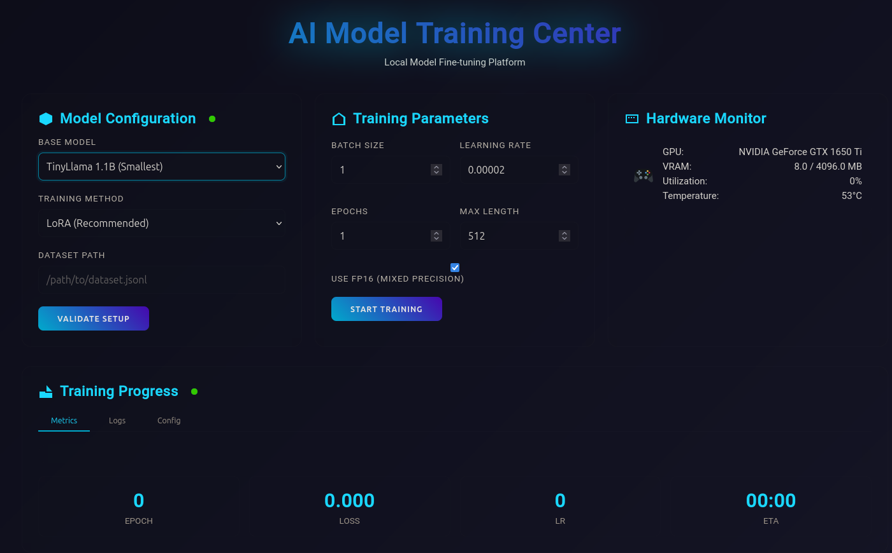
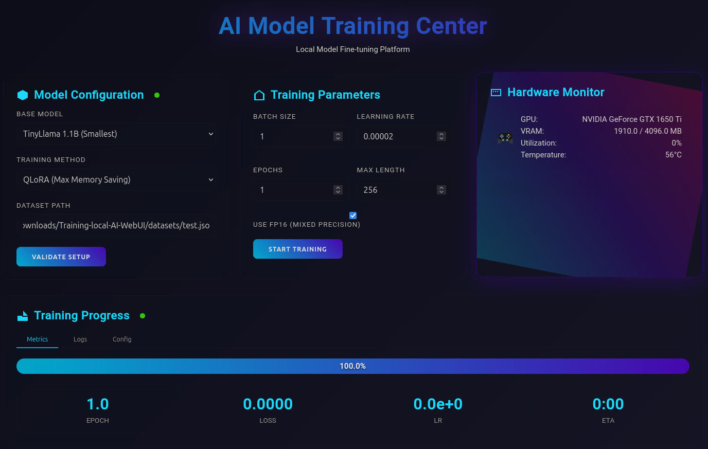

# AI Model Training WebUI 🚀

A comprehensive web-based platform for fine-tuning Large Language Models (LLMs) locally with real-time monitoring and an intuitive interface.

## 📱 Screenshot




## 🎯 Overview

A scalable, self-hosted Web UI for local LLM fine-tuning. Perfect for experimenting on low-VRAM consumer GPUs with QLoRA, yet powerful enough to handle larger models on high-end hardware. Features real-time monitoring. Powered by PyTorch & Transformers. 

### Key Benefits

- **🖥️ Local Training**: Keep your data private by training models on your own hardware
- **📊 Real-time Monitoring**: Track training progress, GPU usage, and metrics live
- **🎨 Modern UI**: Intuitive web interface with a sleek, responsive design
- **⚡ Optimized Performance**: Support for LoRA, QLoRA, and mixed precision training
- **🔧 Easy Setup**: Simple installation process with minimal configuration

## ✨ Features

### Model Support
- **CodeLlama** (7B, 13B) - Specialized for code generation
- **StarCoder** (3B, 7B) - Multi-language code model
- **CodeT5+** (770M) - Efficient encoder-decoder model
- **Pythia** (2.8B) - General-purpose language model
- **etc..**
- Custom model support via HuggingFace Hub

### Training Methods
- **Full Fine-tuning:** Complete model parameter updates
- **LoRA (Low-Rank Adaptation):** Efficient parameter-efficient fine-tuning
- **QLoRA:** Quantized LoRA for reduced memory usage
- **Mixed Precision (FP16):** Faster training with automatic mixed precision


### Interface Features
- **📈 Real-time Metrics Dashboard**
  - Loss curves
  - Learning rate scheduling
  - Training/validation metrics
  - ETA calculations

- **🖥️ Hardware Monitoring**
  - GPU utilization and temperature
  - VRAM usage tracking
  - CPU and system memory stats
  - Real-time performance metrics

- **📁 Dataset Management**
  - Drag-and-drop file upload
  - JSONL/JSON format validation
  - Dataset preview and statistics
  - Automatic train/validation splitting

- **🔄 Training Control**
  - Start/stop/resume training
  - Save checkpoints
  - Export trained models
  - TensorBoard integration

## 💻 System Requirements

### Minimum Requirements
- **OS**: Linux (Ubuntu 20.04+), Windows 10/11, macOS 10.15+
- **Python**: 3.8 or higher
- **RAM**: 16GB
- **GPU**: NVIDIA GPU with 4GB+ VRAM (GTX 1650 or better)
- **Storage**: 50GB free space
- **CUDA**: 11.7 or higher (for GPU support)

### Recommended Specifications
- **RAM**: 32GB+
- **GPU**: NVIDIA RTX 3060 or better (12GB+ VRAM)
- **Storage**: 100GB+ SSD
- **CPU**: 8+ cores

### Tested Hardware Configurations
| GPU | VRAM | Max Model Size | Training Method |
|-----|------|----------------|-----------------|
| GTX 1650 Ti | 4GB | 3B | QLoRA |
| RTX 3060 | 12GB | 7B | LoRA |
| RTX 3090 | 24GB | 13B | Full/LoRA |
| RTX 4090 | 24GB | 20B | Full/LoRA |

## 📁 Project Structure

```
ai-training-webui/
│
├── training_server.py      # Main FastAPI server application
├── requirements.txt        # Python dependencies
├── README.md              # This file
├── LICENSE                # MIT license
├── .gitignore            # Git ignore file
│
├── static/               # Frontend files
│   └── index.html       # Web UI (single-page application)
│
├── datasets/            # Dataset storage (auto-created)
│   ├── example.jsonl   # Example dataset
│   └── ...
│
├── models/              # Model storage (auto-created)
│   └── finetuned/      # Trained models
│       ├── model-1/    # Individual model directories
│       └── logs/       # TensorBoard logs
│
├── scripts/             # Utility scripts
│   ├── convert_dataset.py  # Dataset conversion utilities
│   └── benchmark.py        # Model benchmarking
│
└── docs/                # Additional documentation
    ├── API.md          # API reference
    └── TRAINING.md     # Training guide
```

## 🛠️ Installation

### 1. Clone the Repository

```bash
git clone https://github.com/yourusername/ai-training-webui.git
cd ai-training-webui
```

### 2. Create Virtual Environment

```bash
# Linux/macOS
python3 -m venv venv
source venv/bin/activate

# Windows
python -m venv venv
venv\Scripts\activate
```

### 3. Install Dependencies

```bash
# Upgrade pip
pip install --upgrade pip

# Install PyTorch (adjust for your CUDA version)
# For CUDA 11.8
pip install torch torchvision torchaudio --index-url https://download.pytorch.org/whl/cu118

# For CUDA 12.1
pip install torch torchvision torchaudio --index-url https://download.pytorch.org/whl/cu121

# Install other requirements
pip install -r requirements.txt
```

### 4. Verify Installation

```bash
python -c "import torch; print(f'PyTorch: {torch.__version__}')"
python -c "import torch; print(f'CUDA available: {torch.cuda.is_available()}')"
python -c "import transformers; print(f'Transformers: {transformers.__version__}')"
```

## 🚀 Usage

### Starting the Server

```bash
# Activate virtual environment
source venv/bin/activate  # Linux/macOS
# or
venv\Scripts\activate     # Windows

# Start the server
python training_server.py
```

The server will start on `http://localhost:8000`

### Web Interface

1. **Open your browser** and navigate to `http://localhost:8000`
2. **Select a base model** from the dropdown menu
3. **Choose training method** (LoRA recommended for limited VRAM)
4. **Upload your dataset** or specify a path
5. **Configure training parameters**
6. **Click "Start Training"** to begin

### Using the API

The platform also provides a REST API for programmatic access:

```python
import requests

# Start training
response = requests.post("http://localhost:8000/api/train", json={
    "model": "codellama/CodeLlama-7b-Python-hf",
    "method": "lora",
    "dataset": "datasets/my_data.jsonl",
    "batch_size": 4,
    "learning_rate": 2e-5,
    "epochs": 3
})

# Check status
status = requests.get("http://localhost:8000/api/status").json()
print(f"Progress: {status['progress']}%")
```

## 📚 API Documentation

### Core Endpoints

#### Training Control
- `POST /api/train` - Start training with configuration
- `POST /api/stop` - Stop current training
- `GET /api/status` - Get training status and metrics

#### Dataset Management
- `POST /api/upload` - Upload dataset file
- `GET /api/datasets` - List available datasets
- `DELETE /api/datasets/{filename}` - Delete dataset

#### Model Management
- `GET /api/models` - List available base models
- `GET /api/models/trained` - List trained models
- `GET /api/download/{model_name}` - Download trained model

#### Monitoring
- `WS /ws` - WebSocket for real-time updates
- `POST /api/tensorboard` - Start TensorBoard server

For detailed API documentation, visit `http://localhost:8000/docs` when the server is running.

## ⚙️ Configuration

### Training Parameters

| Parameter | Description | Default | Range |
|-----------|-------------|---------|--------|
| `batch_size` | Training batch size | 4 | 1-32 |
| `learning_rate` | Learning rate | 2e-5 | 1e-6 to 1e-3 |
| `epochs` | Number of training epochs | 3 | 1-100 |
| `max_length` | Maximum sequence length | 512 | 128-2048 |
| `fp16` | Use mixed precision | true | true/false |
| `gradient_checkpointing` | Enable gradient checkpointing | true | true/false |

### Memory Optimization Tips

For limited VRAM (4-8GB):
```json
{
  "method": "qlora",
  "batch_size": 1,
  "gradient_accumulation_steps": 16,
  "max_length": 256,
  "fp16": true,
  "gradient_checkpointing": true
}
```

## 📄 Dataset Format

The platform accepts datasets in JSONL (JSON Lines) format:

### Basic Format
```jsonl
{"instruction": "Write a Python function to calculate factorial", "response": "def factorial(n):\n    if n <= 1:\n        return 1\n    return n * factorial(n-1)"}
{"instruction": "Implement binary search in Python", "response": "def binary_search(arr, target):\n    left, right = 0, len(arr) - 1\n    ..."}
```

### Alternative Format
```jsonl
{"content": "def hello_world():\n    print('Hello, World!')"}
{"content": "class Calculator:\n    def add(self, a, b):\n        return a + b"}
```

### Dataset Preparation Script
```bash
python scripts/convert_dataset.py --input data.csv --output data.jsonl --format instruction
```

## 🔧 Troubleshooting

### Common Issues

#### CUDA Out of Memory
```
Error: CUDA out of memory
```
**Solution**: Reduce batch size, enable gradient checkpointing, or use QLoRA

#### Model Download Fails
```
Error: Connection timeout while downloading model
```
**Solution**: Check internet connection, use a smaller model, or pre-download models

#### Import Errors
```
Error: No module named 'transformers'
```
**Solution**: Ensure virtual environment is activated and requirements are installed

### Performance Optimization

1. **Enable Mixed Precision**: Set `fp16=true` for 2x speedup
2. **Use Gradient Accumulation**: Simulate larger batches with limited VRAM
3. **Enable Gradient Checkpointing**: Trade computation for memory
4. **Use QLoRA**: 4-bit quantization for larger models on limited hardware

### Development Setup
```bash
# Clone the repo
git clone https://github.com/MarkusAureus/ai-model-training-center-webui.git
cd ai-model-training-center-webui

# Create development environment
python -m venv venv-dev
source venv-dev/bin/activate
pip install -r requirements-dev.txt

# Run tests
pytest tests/

# Run linting
flake8 training_server.py
black training_server.py
```


## 📝 License

This project is licensed under the MIT License - see the [LICENSE](LICENSE) file for details.

## 🙏 Acknowledgments

- [Hugging Face](https://huggingface.co/) for Transformers library
- [PyTorch](https://pytorch.org/) team for the deep learning framework
- [FastAPI](https://fastapi.tiangolo.com/) for the web framework
- Community contributors and testers


Made with ❤️
